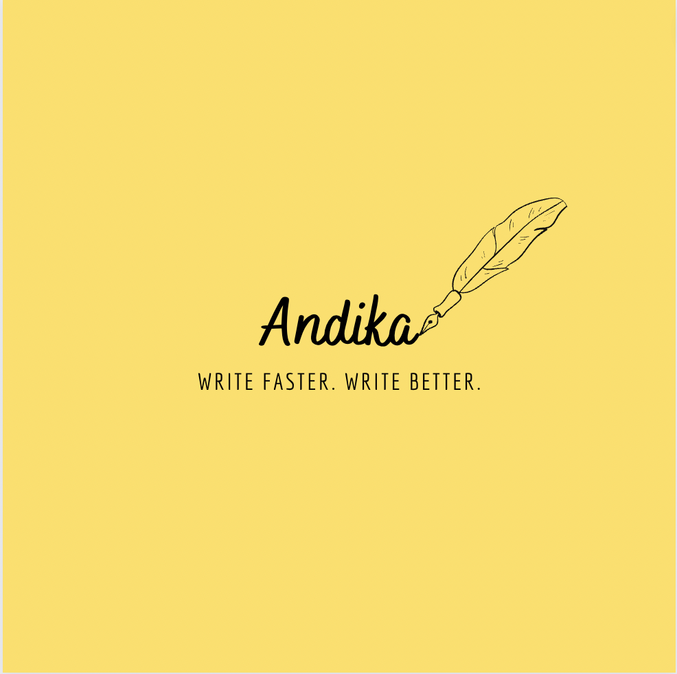

# Andika

<a href="https://nx.dev" target="_blank" rel="noreferrer"></a>

✨ **This workspace has been generated by [Nx, a Smart, fast and extensible build system.](https://nx.dev)** ✨

## Development server

Run `nx serve andika` for a dev server. Navigate to http://localhost:4200/. The app will automatically reload if you change any of the source files.

## Understand this workspace

Run `nx graph` to see a diagram of the dependencies of the projects.

## Remote caching

Run `npx nx connect-to-nx-cloud` to enable [remote caching](https://nx.app) and make CI faster.

## Further help

Visit the [Nx Documentation](https://nx.dev) to learn more.


# TODO FEATURES
- intercomm feature
- business idea pitch
- business ideas
- call to action
- copy writing framework aida
- copy writing framework pas
- coverletter [x]
- facebook,twitter,linkedin ads
- googlesearch ads
- email [x]
- interview questions
- job description [x]
- keyword generator
- landing page website copies
- post caption ideas
- product description bullets
- profile bio [x]
- question answer
- reply to review and messages
- sms notifications
- song lyrics
- story plot
- custom use case
# Running  Functions Locally steps 

clone 
npm i 

npm run build-func

npm run func-serve

npm run shell


npm install --no-package-lock lodash 

This will install the lodash package in the root-level node_modules directory, rather than creating a new node_modules directory inside the my-lib library.

Keep in mind that using the --no-package-lock flag may cause issues with package versions and dependencies, as it prevents the package-lock.json file from being updated with the correct versions of installed packages. It is generally recommended to use the package-lock.json file to ensure consistent and reproducible dependencies across different environments

CTRL+ C - stop emulators


# ChatGPTPrompt generator example

```
write me a detailed chatgpt prompt that generates business idea  based on a language, inerest, skills, tone, usecase, variants, creativityLevel, language
```

# Here are some possible prompt tones that could be used to prompt ChatGPT:

Formal: This tone is used for professional or academic writing and is characterized by formal language, proper grammar, and a neutral tone. It is appropriate for business reports, legal documents, and scholarly articles.

Informal: This tone is used for casual or everyday writing and is characterized by informal language, colloquial expressions, and a more relaxed tone. It is appropriate for emails, text messages, and social media posts.

Sarcastic: This tone is used to express irony or mock something, usually in a humorous way. It can be identified by the use of irony and verbal irony. It can be used to make a point in a witty way or to mock a situation or person.

Persuasive: This tone is used to convince or persuade the reader to take a specific action or believe a certain idea. It can be identified by the use of persuasive language and logical arguments. It is appropriate for speeches, advertisements, and sales pitches.

Inspirational: This tone is used to motivate or inspire the reader. It can be identified by the use of uplifting language and positive messages. It can be used in motivational speeches, self-help books, and motivational quotes.

Descriptive: This tone is used to describe something in detail, usually in a neutral and objective manner. It can be identified by the use of descriptive language and a focus on sensory details. It is appropriate for descriptive essays, travel writing, and product descriptions.

Narrative: This tone is used to tell a story and can be identified by the use of storytelling techniques and a chronological order of events. It is appropriate for novels, short stories, and memoirs.

Humorous: This tone is used to make the reader laugh and can be identified by the use of jokes, puns, and comedic language. It can be used in comedy scripts, stand-up comedy routines, and comedic essays.

Pessimistic: This tone is used to express negativity or doubt about something, it can be identified by the use of negative language and a lack of optimism. It can be used in critiques, reviews, and pessimistic quotes.

Optimistic: This tone is used to express positivity or hope about something, it can be identified by the use of positive language and a sense of optimism. It can be used in positive affirmations, optimistic quotes, and positive thinking.

Confident: This tone is characterized by a sense of certainty and conviction in the ideas or statements being made. It can be identified by the use of strong and assertive language. It's appropriate for leadership speeches, political speeches, and assertive statements.

Thoughtful: This tone is characterized by a reflective and contemplative attitude towards the topic at hand. It can be identified by the use of introspective language and a focus on deeper meaning. It's appropriate for reflective essays, journal entries, and contemplative quotes.

Exciting: This tone is characterized by a sense of energy and enthusiasm towards the topic at hand. It can be identified by the use of lively and energetic language and a focus on action. It's appropriate for adventure stories, travel blogs, and exciting quotes.

Professional: This tone is characterized by a sense of expertise and authority on the topic at hand. It can be identified by the use of technical language, specific terminology, and a focus on accuracy. It's appropriate for technical manuals, professional reports, and expert statements.

Casual: This tone is characterized by a relaxed and informal approach to the topic at hand. It can be identified by the use of informal language, colloquial expressions, and a focus on personal anecdotes or experiences. It's appropriate for casual conversations, casual blog posts, and personal stories.

Enthusiastic: This tone is characterized by a strong show of excitement, interest and energy towards the topic at hand. It can be identified by the use of energetic and positive language and a focus on the benefits or potential of the topic. It's appropriate for product reviews, sales pitches and motivational speeches.

Detailed: This tone is characterized by a focus on providing extensive and thorough information about the topic at hand. It can be identified by the use of specific examples, statistics and technical details. It's appropriate for scientific papers, research reports, and technical manuals.

Serious: This tone is characterized by a formal, solemn and serious approach to the topic at hand. It can be identified by the use of formal language, a lack of humor, and a focus on the gravity of the topic. It's appropriate for legal documents, speeches, and serious news articles.

Thought-provoking: This tone is characterized by an attempt to stimulate intellectual curiosity and challenge the reader's perspective on the topic. It can be identified by the use of rhetorical questions, complex ideas, and a focus on the broader implications of the topic. It's appropriate for philosophical essays, debates, and thought-provoking quotes.

Emotional: This tone is characterized by an attempt to elicit an emotional response from the reader. It can be identified by the use of descriptive language, vivid imagery, and a focus on personal experiences or feelings. It's appropriate for poetry, personal essays, and emotional quotes.

Romantic: This tone is characterized by an attempt to express feelings of love, affection, and tenderness. It can be identified by the use of descriptive language, imagery and a focus on the emotional connection between people. It's appropriate for love letters, romantic poetry and romantic quotes.

Poetic: This tone is characterized by an attempt to express ideas, emotions or experiences in an imaginative and creative way. It can be identified by the use of figurative language, imagery and a focus on rhythm, rhyme, and sound. It's appropriate for poetry, song lyrics and artistic quotes.

Philosophical: This tone is characterized by an attempt to explore the nature of reality, knowledge, values, reason, mind, and language. It can be identified by the use of complex ideas, abstract concepts and a focus on the underlying meaning of things. It's appropriate for philosophical essays, debates and philosophical quotes.

Informative: This tone is characterized by an attempt to provide information about a topic in a neutral, objective and informative way. It can be identified by the use of factual information, statistics and references. It's appropriate for news articles, educational materials and informative quotes.

Expository: This tone is characterized by an attempt to explain or clarify a topic in a logical and organized way. It can be identified by the use of definitions, examples, and evidence. It's appropriate for instructional manuals, how-to guides and explanatory quotes.

Explanatory: This tone is characterized by an attempt to provide a detailed and comprehensive explanation of a topic. It can be identified by the use of technical language, examples and evidence. It's appropriate for scientific papers, research reports and technical manuals.

Persuasive: This tone is characterized by an attempt to influence the opinions or actions of the reader. It can be identified by the use of logical arguments, evidence

```
This is a comprehensive list of various possible prompt tones that could be used to prompt ChatGPT. However, there may be more tones that can be used depending on your specific use case or application, these are just examples and not an exhaustive list.

Please note that you can also combine or mix different tones together to create a more nuanced and complex prompt. Also, it's important to note that the tone you choose will depend on the context and purpose of your text generation task. 
```